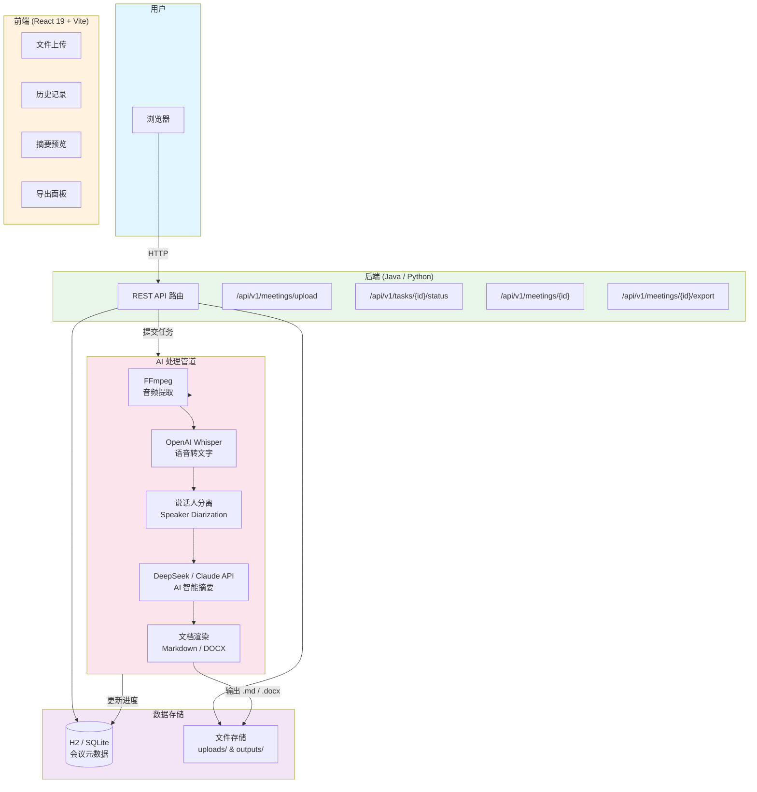

# MeetingSum — 会议学习视频智能总结工具

上传会议录屏或学习视频，自动生成结构化的会议纪要（Markdown / Word 文档），支持语音转文字、说话人分离、AI 智能摘要。

## 功能

- **多格式上传** — 支持 MP4 / MOV / AVI / MKV / MP3 / WAV / M4A / WebM 等音视频格式，最大 2GB / 4 小时
- **语音转写** — 基于 OpenAI Whisper 本地离线转写，支持中英文
- **说话人分离** — 自动识别并标注不同说话人的对话段落
- **AI 摘要** — 调用 Claude API / GPT-4 生成结构化摘要，提取关键讨论点、决策记录、行动项
- **文档导出** — 一键导出为 Markdown 或 Word 文件
- **历史管理** — 搜索、查看、删除历史会议记录
- **实时进度** — 处理进度实时推送（音频提取 → 转写 → 摘要生成）

## 输出文档示例

```markdown
# [会议标题]

## 基本信息
- 日期：2026-05-24
- 时长：01:23:45
- 主讲人：张三、李四

## 会议摘要
[200-300 字整体摘要]

## 关键讨论点
1. 议题一：...
2. 议题二：...

## 决策记录
- [ ] 决策一
- [ ] 决策二

## 行动项
- [ ] 行动项一 — 负责人：张三 — 截止日期：2026-05-30
```

## 技术栈

| 层级 | 技术 |
|------|------|
| 前端 | React 19 + TypeScript + Vite + Ant Design + Zustand + Tailwind CSS |
| 后端（Java） | Java 17 + Spring Boot 3.3 + Spring Data JPA + H2 Database + LangChain4j |
| 后端（Python） | Python 3.11 + FastAPI + Celery + SQLAlchemy + Redis |
| AI | OpenAI Whisper（语音识别）+ DeepSeek / Claude API（摘要生成） |
| 音视频 | FFmpeg（音频提取） |
| 数据库 | H2 / SQLite（开发） |

## 系统架构



**数据流：** 用户上传视频 → 前端通过 API 提交任务 → 后端异步处理（Java @Async / Python Celery）→ FFmpeg 提取音频 → Whisper 转写 → 说话人分离 → DeepSeek/Claude API 生成摘要 → 文档渲染 → 结果写入文件和数据库

## 项目结构

```
meeting-summarizer/
├── frontend/                    # React 前端
│   ├── src/
│   │   ├── components/          # UI 组件
│   │   │   ├── Uploader/        # 文件上传
│   │   │   ├── HistoryList/     # 历史记录
│   │   │   ├── SummaryViewer/   # 摘要预览
│   │   │   ├── ExportPanel/     # 导出面板
│   │   │   └── Layout/          # 布局
│   │   ├── pages/               # 页面（Home / History / Summary / Settings）
│   │   ├── stores/              # Zustand 状态管理
│   │   ├── api/                 # API 请求封装
│   │   ├── types/               # TS 类型
│   │   └── utils/               # 工具函数
│   └── package.json
├── Java_backend/                # Spring Boot 后端（Java 实现）
│   ├── src/main/java/com/meetingsum/
│   │   ├── config/              # 配置（AppProperties / CORS / Async）
│   │   ├── controller/          # REST 控制器 + 全局异常处理
│   │   ├── model/               # 实体 + DTO + 枚举
│   │   ├── pipeline/            # AI 处理管道（音频提取→转写→分离→摘要→导出）
│   │   ├── repository/          # JPA Repository
│   │   ├── service/             # 业务逻辑层
│   │   └── util/                # 工具类
│   ├── src/main/resources/
│   │   └── application.yml      # 应用配置
│   └── pom.xml
├── backend/                     # FastAPI 后端（Python 实现）
│   ├── app/
│   │   ├── api/                 # REST API 路由
│   │   ├── core/                # 配置 / 数据库 / 安全
│   │   ├── models/              # SQLAlchemy 数据模型
│   │   ├── services/            # 业务逻辑层
│   │   ├── pipeline/            # AI 处理管道
│   │   ├── templates/           # Jinja2 文档模板
│   │   └── workers/             # Celery 后台任务
│   └── requirements.txt
└── README.md
```

## 快速开始

### 前置依赖

- Node.js >= 20
- FFmpeg >= 5.0（音频提取 + Whisper 内部调用）
- DeepSeek API Key 或 Anthropic API Key（AI 摘要）
- Java >= 17 + Maven >= 3.6（若使用 Java 后端）
- Python >= 3.11 + Redis >= 7.0（若使用 Python 后端）

### 方式一：Java 后端（Spring Boot）

```bash
# 1. 安装 Python 依赖（Whisper 语音识别）
pip install openai-whisper

# 2. 配置
cd Java_backend
# 编辑 src/main/resources/application.yml
#   - ffmpeg-path: 设为你的 FFmpeg 安装路径
#   - deepseek-api-key: 填入你的 API Key

# 3. 启动后端
mvn spring-boot:run
# API: http://localhost:8080
# H2 控制台: http://localhost:8080/h2-console
```

### 方式二：Python 后端（FastAPI）

```bash
# 1. 安装依赖
cd backend
python -m venv .venv
source .venv/bin/activate   # Windows: .venv\Scripts\activate
pip install -r requirements.txt
cp .env.example .env        # 编辑 .env 填入 API Key

# 2. 启动 Redis
docker run -d -p 6379:6379 redis:7-alpine

# 3. 启动后端
uvicorn app.main:app --reload --port 8000

# 4. 另开终端启动 Celery Worker
celery -A app.workers.celery_app worker --loglevel=info
```

### 启动前端

```bash
cd frontend
npm install
npm run dev
# 访问 http://localhost:5173
```

## API 概览

| 方法 | 路径 | 说明 |
|------|------|------|
| `POST` | `/api/v1/meetings/upload` | 上传音视频文件 |
| `GET` | `/api/v1/meetings` | 获取历史会议列表 |
| `GET` | `/api/v1/meetings/{id}` | 获取会议详情 |
| `DELETE` | `/api/v1/meetings/{id}` | 删除会议记录 |
| `GET` | `/api/v1/tasks/{id}/status` | 查询任务处理进度 |
| `GET` | `/api/v1/meetings/{id}/export?format=md` | 导出 Markdown |
| `GET` | `/api/v1/meetings/{id}/export?format=docx` | 导出 Word |

## 配置项

**Java 后端** — 编辑 `Java_backend/src/main/resources/application.yml`：

```yaml
app:
  # 语音识别
  whisper-model: medium          # tiny / base / small / medium / large-v3
  whisper-device: cpu            # cpu | cuda

  # LLM 摘要
  llm-provider: deepseek         # deepseek | claude
  deepseek-api-key: sk-xxx
  anthropic-api-key: ""

  # FFmpeg（必须配置为实际路径）
  ffmpeg-path: D:/work/ffmpeg/bin/ffmpeg.exe
  ffprobe-path: D:/work/ffmpeg/bin/ffprobe.exe

  # 文件限制
  max-file-size-mb: 2048
  max-video-duration-seconds: 14400
  allowed-formats: mp4,mov,avi,mkv,mp3,wav,m4a,webm
```

**Python 后端** — 编辑 `backend/.env`：

```ini
WHISPER_MODEL=medium
WHISPER_DEVICE=cpu

LLM_PROVIDER=claude
ANTHROPIC_API_KEY=sk-ant-xxx
ANTHROPIC_MODEL=claude-sonnet-4-6

MAX_FILE_SIZE_MB=2048
MAX_VIDEO_DURATION_SECONDS=14400
```

## 处理流程

```
上传视频 → FFmpeg 提取音频 → Whisper 语音转文字
    → 说话人分离 → DeepSeek / Claude API 智能摘要 → 文档渲染输出 .md / .docx
```

任务阶段：`extracting_audio → transcribing → summarizing → exporting`

任务状态机：`pending → processing → completed / failed`

## License

MIT
